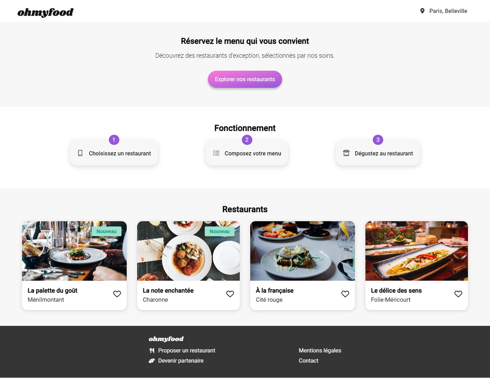

# OhMyFood
### OpenClassrooms P3 - Dynamisez une page web avec des animations CSS

**OhMyFood** est une **jeune startup** qui voudrait s'imposer sur le **marché de la restauration**. L'objectif est de **développer un site 100% mobile** qui répertorie les **menus** de restaurants gastronomiques, en intégrant les maquettes avec **HTML**, **CSS** et **Sass** et an ajoutant des **animations** pour dynamiser le site. *En plus des systèmes classiques de réservation, les clients pourront composer le menu de leur repas pour que les plats soient prêts à leur arrivée. Finis, les temps d'attente au restaurant !*

## Spécifications

La cible étant les personnes connectées et pressées, le site a été développé en utilisant l’approche **mobile-first**. Pour cette raison, seules des maquettes mobiles ont été réalisées. Sur tablette et desktop, le site peut s'adapter, mais ces supports n’étant pas prioritaires, leur mise en page était libre
* L’ensemble du site est **responsive** sur mobile, tablette et desktop
* Les pages passent la **validation W3C** [HTML](https://validator.w3.org/) et [CSS](https://jigsaw.w3.org/css-validator/) sans erreur
* Le site est compatible avec les dernières versions desktop de Chrome et Firefox

## Contenu des pages

### Page d’accueil
* Affichage de la **localisation** des restaurants. *À terme il sera possible de choisir sa localisation pour trouver des restaurants proches d’un certain lieu*
* Une courte **présentation** de l’entreprise
* Une section contenant les **4 menus** sous forme de **cartes**. Au **clic** sur la carte, l’utilisateur est **redirigé** vers la **page du menu**

### Pages de menu
* 4 pages contenant chacune le **menu d’un restaurant**

### Footer
* Le footer est identique sur toutes les pages
* Au clic sur “Contact”, un renvoi vers une adresse mail est effectué

### Header
* Le header est présent sur toutes les pages
* Sur la page d’accueil, il contient le **logo du site**
* Sur les pages de menu, il contient en plus un **bouton de retour** vers la page d’accueil

## Effets graphiques et animations

### Boutons

* Au survol, la couleur de fond des **boutons principaux** s’éclaircit légèrement. L’ombre portée est également être plus visible.
* À terme, les visiteurs pourront sauvegarder leurs menus préférés. Pour ça, un **bouton "J’aime"** en forme de cœur est présent sur la maquette. Au clic, il se remplit progressivement. *Pour cette première version, l’effet apparaît au survol sur desktop au lieu du clic*

### Page d’accueil

* Un **"loading spinner"** apparaît pendant 3 secondes quand on arrive sur la page d'accueil, couvre l'intégralité de l'écran, et utilise les animations CSS (pas de librairie). Le design de ce loader n’était pas défini, il s'agit donc d'une proposition (en cohérence avec la charte graphique du site)

### Pages de menu
* À l’arrivée sur la page, les **plats apparaissent progressivement** avec un léger **décalage** dans le temps. Ils apparaissent **un par un**, avec un léger **décalage** supplémentaire **par catégorie** "Entrée", "Plat" et "Dessert"
* Le visiteur peut ajouter les plats qu'il souhaite à sa commande en cliquant dessus. Cela fait apparaître une **petite coche à droite du plat**. Cette coche **coulisse** de la droite vers la gauche. *Pour cette première version, l’effet apparaît au survol sur desktop au lieu du clic.* Si l’intitulé du plat est trop long, il est **rogné** avec des **points de suspension**

